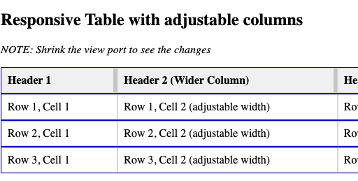

<!-- [Cards](./card/card.html) or  -->

| <a href="../readme.md">Return to Documentation</a> <br> <br>Code Below |  |
| ---------------------------------------------------------------------- | ------------------------------------------------------------ |

<a href="./divtableadjustcol.html" target="blank">VIEW DIV TABLE W/ ADJUSTABLE COLS</a>

```
<!DOCTYPE html>
<html lang="en">
	<head>
		<meta charset="UTF-8" />
		<!-- needed for mobile first -->
		<meta name="viewport" content="width=device-width, initial-scale=1.0" />

		<title>Responsive Flex Table with Adjustable Columns</title>
		<style>
			/* Basic table styling using flexbox */
			.table {
				display: flex;
				flex-direction: column;
				width: 100%;
			}

			.header,
			.row {
				display: flex;
				width: 100%;
				border: 1px solid blue;
			}

			.cell {
				padding: 8px;
				text-align: left;
				border: 1px solid #ddd;
				position: relative;
				overflow: hidden;
			}

			/* Resizable column */
			.resizable {
				resize: horizontal; /* 2 lines in lower right */
				overflow: hidden;
				white-space: nowrap;
			}

			/* Resizer handle */
			.resizer {
				width: 5px; /*width of right side col */
				height: 100%;
				position: absolute;
				top: 0;
				right: 0;
				cursor: col-resize;
				background-color: #ccc;
				user-select: none;
			}

			.header {
				background-color: #f2f2f2;
				font-weight: bold;
			}

			/* For smaller screens (mobile) */
			@media (max-width: 600px) {
				.table {
					display: block;
				}

				.row {
					display: block;
					/* border: 1px solid #ddd; */
					margin-bottom: 10px;
					/* border-radius: 8px; */
					background-color: #f9f9f9;
					/* box-shadow: 0 2px 5px rgba(0, 0, 0, 0.1); */
				}

				/* For smaller screens (mobile) */

				.header {
					display: none; /* Hide main table header on mobile */
				}

				.header-card {
					display: block;
					font-weight: bold;
					background-color: #4caf50;
					color: white;
					padding: 10px;
					text-align: center;
					border-radius: 8px 8px 0 0;
				}

				.cell {
					display: block;
					/* border: none; */
					padding: 10px;
					text-align: left;
					/* border-bottom: 1px solid #eee; */
				}

				.cell:last-child {
					border-bottom: none;
				}
			}
		</style>
	</head>
	<body>
		<button id="home">back to home</button>
		<hr />

		<h2>Responsive Table with adjustable columns</h2>

		<p><em>NOTE: Shrink the view port to see the changes</em></p>

		<div class="table" id="table">
			<!-- Table Header Row for Desktop View -->
			<div class="header">
				<div class="cell" style="flex: 1" data-col="1">
					Header 1
					<div class="resizer"></div>
				</div>
				<div class="cell" style="flex: 2" data-col="2">
					Header 2 (Wider Column)
					<div class="resizer"></div>
				</div>
				<div class="cell" style="flex: 1" data-col="3">
					Header 3
					<div class="resizer"></div>
				</div>
			</div>

			<!-- Row 1 with its unique header for mobile -->
			<div class="row">
				<div class="cell" style="flex: 1" data-col="1">Row 1, Cell 1</div>
				<div class="cell" style="flex: 2" data-col="2">Row 1, Cell 2 (adjustable width)</div>
				<div class="cell" style="flex: 1" data-col="3">Row 1, Cell 3</div>
			</div>

			<!-- Row 2 with its unique header for mobile -->
			<div class="row">
				<div class="cell" style="flex: 1" data-col="1">Row 2, Cell 1</div>
				<div class="cell" style="flex: 2" data-col="2">Row 2, Cell 2 (adjustable width)</div>
				<div class="cell" style="flex: 1" data-col="3">Row 2, Cell 3</div>
			</div>

			<!-- Row 3 with its unique header for mobile -->
			<div class="row">
				<div class="cell" style="flex: 1" data-col="1">Row 3, Cell 1</div>
				<div class="cell" style="flex: 2" data-col="2">Row 3, Cell 2 (adjustable width)</div>
				<div class="cell" style="flex: 1" data-col="3">Row 3, Cell 3</div>
			</div>
		</div>

		<p>SPECIAL NOTE: NEED TO CHANGE FROM FLEX TO PIXEL VALUE PERCENTAGES</p>
	</body>
</html>

<script>
	const resizers = document.querySelectorAll(".resizer");
	const table = document.getElementById("table");

	resizers.forEach(function (resizer) {
		let x = 0;
		let w = 0;
		let colIndex;

		const cell = resizer.parentElement;
		const colCells = document.querySelectorAll(`.cell[data-col="${cell.dataset.col}"]`);

		resizer.addEventListener("mousedown", function (e) {
			x = e.clientX;
			w = cell.offsetWidth;
			colIndex = cell.dataset.col;

			document.addEventListener("mousemove", mouseMoveHandler);
			document.addEventListener("mouseup", mouseUpHandler);
		});

		function mouseMoveHandler(e) {
			const dx = e.clientX - x;
			const newWidth = w + dx;
			const flexGrow = (newWidth / table.offsetWidth).toFixed(2);

			// Update the flex-grow property for all cells in the same column
			colCells.forEach((colCell) => {
				colCell.style.flex = flexGrow;
			});
		}

		function mouseUpHandler() {
			document.removeEventListener("mousemove", mouseMoveHandler);
			document.removeEventListener("mouseup", mouseUpHandler);
		}
	});
</script>

<script>
	document.getElementById("home").addEventListener("click", () => {
		window.location.href = "../index.html";
	});
</script>

```
