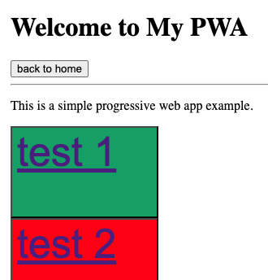

<!-- [Cards](./card/card.html) or  -->

| <a href="../readme.md">Return to Documentation</a> <br> <br>Code Below |  |
| ---------------------------------------------------------------------- | -------------------------------- |

<a href="./pwasimple.html" target="blank">VIEW PWA</a>

```

<!DOCTYPE html>
<html lang="en">
	<head>
		<meta charset="UTF-8" />
		<!-- needed on every pagefor pwa -->
		<meta name="viewport" content="width=device-width, initial-scale=1.0, maximum-scale=1.0, user-scalable=no viewport-fit=cover" />


		<meta name="theme-color" content="#fff" />
		<title>Simple PWA</title>

		<!-- THIS IS ONE OF THE KEYS FOR A PWA -->
		<link rel="manifest" href="./manifest.json" />

		<!-- needed on every page for pwa -->
		<link rel="stylesheet" href="./pwasimple.css" />

	</head>
	<body style="padding: 1em" onload="welcomeSound()">
		<h1>Welcome to My PWA</h1>

		<button id="home">back to home</button>
		<hr />

		<p>This is a simple progressive web app example.</p>

		<div>
			<button id="test1" style="background-color: #04aa6d; font-size: 50px; padding-bottom: 1em; padding-right: 1em"><a href="#">test 1</a></button>
		</div>

		<div>
			<button id="test2" style="background-color: #ff0000; font-size: 50px; padding-bottom: 1em; padding-right: 1em"><a href="./page2.html">test 2</a></button>
		</div>

		<div>
			<button id="test3" style="background-color: #ffa500; font-size: 50px; padding-bottom: 1em; padding-right: 1em"><a href="#">test 3</a></button>
		</div>

		<div>
			<button id="test4" style="background-color: #ffff00; font-size: 50px; padding-bottom: 1em; padding-right: 1em"><a href="#">test 4</a></button>
		</div>

		<div>
			<button id="test5" style="background-color: #800080; font-size: 50px; padding-bottom: 1em; padding-right: 1em"><a href="#">test 5</a></button>
		</div>

		<div>
			<button id="test6" style="background-color: #ff00ff; font-size: 50px; padding-bottom: 1em; padding-right: 1em"><a href="#">test 6</a></button>
		</div>

		<div>
			<button id="test7" style="background-color: #00ff00; font-size: 50px; padding-bottom: 1em; padding-right: 1em"><a href="#">test 6</a></button>
		</div>

		<script>
			if ("serviceWorker" in navigator) {
				window.addEventListener("load", function () {
					navigator.serviceWorker.register("./sw.js").then(
						function (registration) {
							console.log("ServiceWorker registration successful with scope: ", registration.scope);
						},
						function (err) {
							console.log("ServiceWorker registration failed: ", err);
						}
					);
				});
			}
		</script>

		<audio id="welcome-sound" src="./dotted-spiral.mp3" preload="auto"></audio>

		<script>
			const welcomeSound = document.getElementById("welcome-sound");
			welcomeSound.play();
			// alert("Page is loaded");
		</script>

		<script>
			document.getElementById("home").addEventListener("click", () => {
				window.location.href = "../index.html";
			});
		</script>
	</body>
</html>


```
