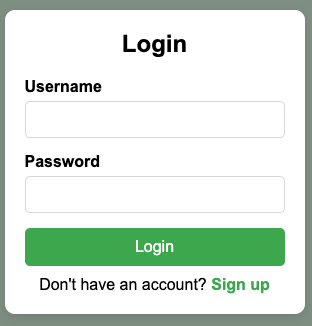
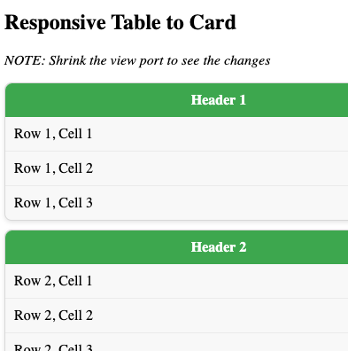
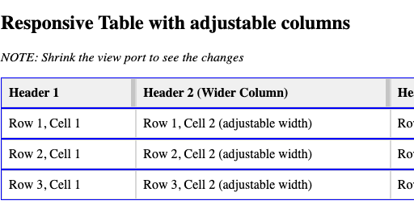
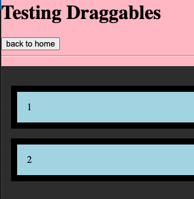

# Toolbox Documentation

Here is a list of some of the most common tools used in GLDA development.

## Quick Start

Each folder should contain an html page with the tool so you can see what it looks like.

In **most** cases, the Styles, HTML and JS should all be on the same page.

Simply extract the code you need to use and plug it into your own proect.

## Cards

<!-- [Cards](./card/card.html) or  -->

| Click me for code - <a href="./card/card.html" target="blank">Card</a> |  |
| ---------------------------------------------------------------------- | --------------------------------------- |

## Div Table

| Click me for code - <a href="./divtable/divtable.html" target="blank">Div Table</a> |  |
| ----------------------------------------------------------------------------------- | ---------------------------------------------------- |

## Div Table w/ Adjustable Cols

| Click me for code - <a href="./divtableadjustcol/divtableadjustcol.html" target="blank">Div Table w/ Adj. Columns</a> |  |
| --------------------------------------------------------------------------------------------------------------------- | ------------------------------------------------------------------------------------ |

## Draggable Divs

| Click me for code - <a href="./draggable/draggable.html" target="blank">Draggable Divs</a> |  |
| ------------------------------------------------------------------------------------------ | ------------------------------------------------------- |

## Simple PWA

<a href="./pwasimple/pwasimple.html" target="blank">Simple Progressive Web App</a>

## Table Element w/ Adjustable Cols and Rows

<a href="./tableadjcolrow/tableadjcolrow.html" target="blank">Table Element w/ Adjustable Columns and Rows</a>
