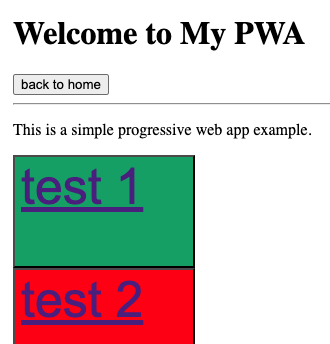

# Toolbox Documentation

Here is a list of some of the most common tools used in GLDA development.  https://www.notion.so/gdla/Technical-Documentation-18b9a21e9787456e8ec9691650f6df46

## Quick Start

Each folder should contain an html page with the tool so you can see what it looks like.

In **most** cases, the Styles, HTML and JS should all be on the same page.

Simply extract the code you need to use and plug it into your own proect.

## Cards

<!-- [Cards](./card/card.html) or  -->

| Click me for code - <a href="./card/card.md" target="blank">Card</a> |  |
| -------------------------------------------------------------------- | --------------------------------------- |

## Div Table

| Click me for code - <a href="./divtable/divtable.md" target="blank">Div Table</a> |  |
| --------------------------------------------------------------------------------- | ---------------------------------------------------- |

## Div Table w/ Adjustable Cols

| Click me for code - <a href="./divtableadjustcol/divtableadjustcol.md" target="blank">Div Table w/ Adj. Columns</a> |  |
| ------------------------------------------------------------------------------------------------------------------- | -------------------------------------------------------------------------------------- |

## Draggable Divs

| Click me for code - <a href="./draggable/draggable.md" target="blank">Draggable Divs</a> |  |
| ---------------------------------------------------------------------------------------- | ------------------------------------------------------- |

## Simple PWA

| Click me for code - <a href="./pwasimple/" target="blank">PWA</a> |  |
| ----------------------------------------------------------------- | ------------------------------------------ |

## Table Element w/ Adjustable Cols and Rows

| Click me for code - <a href="./tableadjcolrow/tableadjcolrow.html" target="blank">Table w/ Adjustable Col-Row</a> |  |
| ----------------------------------------------------------------------------------------------------------------- | --------------------------------------------------------------------------- |
